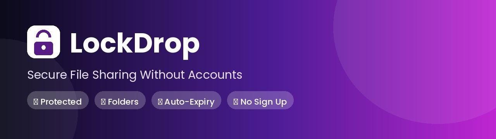

<div align="center">
  
</div>

<div align="center">

### 🔒 Secure File Sharing — No Accounts, No Sign-Up, Ever

*Upload a file, folder, or a batch of files → lock it with a password → share the password.*

[](https://mylockdrop.vercel.app)
[](LICENSE)
[](https://react.dev)
[](https://nodejs.org)

[🔗 Live Site](https://mylockdrop.vercel.app) · [🐞 Report a Bug](https://github.com/atanudas18/LockDrop/issues) · [✨ Request a Feature](https://github.com/atanudas18/LockDrop/issues)

</div>

---

### 🎬 Demo

<div align="center">

*(Add your screen-recording or screenshots here — see the note at the bottom of this section for exactly how.)*

| Upload | Download |
|---|---|
|  |  |

</div>

> 📸 **How to swap in your own screenshots/GIF (2 minutes, no extra tools):**
> 1. On GitHub.com, open this README file and click the ✏️ pencil (edit) icon.
> 2. Drag and drop a screenshot, GIF, or short screen-recording (`.mp4`/`.mov`/`.gif`) directly into the text box.
> 3. GitHub auto-uploads it and inserts a link like `https://github.com/user-attachments/assets/...` — that's a permanent, free-hosted link.
> 4. Replace the placeholder table above with that link, commit, done.

---

## 📑 Table of Contents

| | | |
|---|---|---|
| [🧠 Overview](#-overview) | [✨ Features](#-features) | [🧰 Tech Stack](#-tech-stack) |
| [⚙️ How It Works](#️-how-it-works) | [📂 Project Structure](#-project-structure) | [🚀 Local Setup](#-local-setup) |
| [☁️ Deployment](#️-deployment) | [🔑 Environment Variables](#-environment-variables) | [📡 API Reference](#-api-reference) |
| [🛡️ Security Notes](#️-security-notes) | [🗺️ Future Improvements](#️-future-improvements) | [🤝 Contributing](#-contributing) |

---

## 🧠 Overview

**LockDrop** is a zero-account file-sharing tool. Instead of usernames and passwords tied to a person, **the password *is* the access key** — set one on upload, share it with whoever needs the file, and it works until it expires. No database of users, no login screen, no tracking who you are.

Built to explore secure, ephemeral file transfer — password hashing, temporary cloud storage, automatic expiry, and folder zipping — without any of the usual account-management overhead.

---

## ✨ Features

| | |
|---|---|
| 🔐 **Password Protection** | Every upload is locked behind a password — hashed with bcrypt, never stored in plain text |
| 📁 **Folder Uploads** | Drag & drop an entire folder — it's zipped securely on the backend before storage |
| ⏳ **Auto-Expiry** | Set an expiry (1 hour → custom date); files self-destruct automatically, no manual cleanup |
| 🙈 **Zero Accounts** | No sign up, no login, no personal data collected — the password is the only key |
| ⚡ **Fast & Lightweight** | React + Vite frontend, Express backend — built for speed, not bloat |
| 🧹 **Self-Cleaning** | A cron job sweeps expired files every 5 minutes so nothing lingers in storage |
| 📊 **Live Upload Feedback** | Real-time progress bar with speed/ETA, plus a "finalizing" state for large folders |

---

## ⚙️ How It Works

1. **Upload** — pick a file, multiple files, or a whole folder (zipped with `archiver` on the backend), set a password + expiry, hit upload. The password is bcrypt-hashed before it ever touches the database.
2. **Share** — send the password to whoever needs the file, any way you like (chat, email, in person).
3. **Download** — they open `/download`, enter the password. If it matches an active upload, they see the file's metadata (name, size, type, expiry, download count) and a download button.
4. **Self-destruct** — a scheduled job sweeps every 5 minutes for anything past its expiry, deletes it from cloud storage, then removes its database record.

> Because there are no accounts, `/verify` finds the right file by checking the submitted password against every *active* upload's bcrypt hash — the password itself is the lookup key.

---

## 🧰 Tech Stack

<div align="center">

| Layer | Stack |
|---|---|
| **Frontend** |     |
| **Backend** |    |
| **Storage / Infra** |    |

</div>

---

## 📂 Project Structure

```
lockdrop/
├── backend/
│   ├── config/          # MongoDB + Cloudinary connection setup
│   ├── models/          # Upload.js mongoose schema
│   ├── middleware/      # rate limiting, error handling
│   ├── routes/          # upload.js, verify.js, download.js
│   ├── utils/           # sanitize, zip, cron cleanup
│   └── server.js
├── frontend/
│   ├── src/
│   │   ├── api/          # axios instance
│   │   ├── components/   # Navbar, Footer, Puppy, GradientBackground, ProgressBar
│   │   ├── pages/         # Home, Upload, Download
│   │   └── App.jsx
│   ├── public/            # favicon, og-image, apple-touch-icon
│   ├── index.html
│   └── vercel.json
├── LICENSE
└── README.md
```

---

## 🚀 Local Setup

**Clone the repository**
```bash
git clone https://github.com/atanudas18/LockDrop.git
cd LockDrop
```

**1. Backend**
```bash
cd backend
npm install
cp .env.example .env
# fill in MONGO_URI, CLOUDINARY_* credentials in .env
npm run dev
```
Runs on `http://localhost:5000`

**2. Frontend**
```bash
cd frontend
npm install
cp .env.example .env
# VITE_API_URL should point at your backend, e.g. http://localhost:5000
npm run dev
```
Runs on `http://localhost:5173`

<details>
<summary>📦 MongoDB Atlas Setup</summary>

1. Create a free cluster at [mongodb.com/cloud/atlas](https://www.mongodb.com/cloud/atlas)
2. Create a database user and allow network access (or `0.0.0.0/0` for testing)
3. Copy the connection string into `backend/.env` as `MONGO_URI`

</details>

<details>
<summary>☁️ Cloudinary Setup</summary>

1. Create a free account at [cloudinary.com](https://cloudinary.com)
2. From the dashboard, copy `Cloud Name`, `API Key`, and `API Secret`
3. Put them into `backend/.env` as `CLOUDINARY_CLOUD_NAME`, `CLOUDINARY_API_KEY`, `CLOUDINARY_API_SECRET`

</details>

---

## ☁️ Deployment

| | Platform | Steps |
|---|---|---|
| **Backend** | Render | Push to GitHub → New Web Service → root `backend/` → Build: `npm install` → Start: `npm start` → add env vars → set `CLIENT_URL` to your frontend URL |
| **Frontend** | Vercel | New Project → root `frontend/` → Framework: Vite → add `VITE_API_URL` env var → Deploy |

---

## 🔑 Environment Variables

**`backend/.env`**
```env
PORT=5000
NODE_ENV=production
CLIENT_URL=https://your-frontend.vercel.app
MONGO_URI=mongodb+srv://...
CLOUDINARY_CLOUD_NAME=...
CLOUDINARY_API_KEY=...
CLOUDINARY_API_SECRET=...
BCRYPT_SALT_ROUNDS=12
RATE_LIMIT_WINDOW_MS=900000
RATE_LIMIT_MAX=100
LOCKDROP_SECRET=...
```

**`frontend/.env`**
```env
VITE_API_URL=https://your-backend.onrender.com
```

---

## 📡 API Reference

| Method | Route | Description |
|---|---|---|
| `POST` | `/upload` | multipart form: `files`, `password`, `expiry`, optional `customDate`, `isFolder`, `folderName` |
| `POST` | `/verify` | JSON `{ password }` → returns file metadata + an id |
| `GET` | `/download/:id` | streams the file, increments `downloadCount` |
| `GET` | `/health` | health check |

> Expired files are swept automatically every 5 minutes — no dedicated delete endpoint is exposed publicly.

---

## 🛡️ Security Notes

- ✅ Helmet sets secure HTTP headers; CORS is locked to `CLIENT_URL`
- ✅ Separate, stricter rate limits on `/upload` and `/verify` to slow abuse/brute-force
- ✅ Filenames are sanitized (basename-only, character allowlist) to prevent directory traversal
- ✅ Passwords are bcrypt-hashed — never logged, never stored in plain text
- ✅ Password lookup only compares against *active* (non-expired) uploads

---

## 🗺️ Future Improvements

- 🔔 Optional email notification when a shared file is downloaded
- 📈 Upload analytics dashboard (anonymous, per-link)
- 🌍 Multi-language UI
- 🖼️ Inline preview for images/PDFs before download
- 🔗 Custom short links for shares

---

## 🤝 Contributing

Contributions, issues, and feature requests are welcome!

1. Fork the repository
2. Create a branch: `git checkout -b feature/your-feature`
3. Commit your changes: `git commit -m "Add your feature"`
4. Push and open a Pull Request

---

## 📄 License

This project is licensed under the **[MIT License](LICENSE)**.

---

<div align="center">

### 👤 Author

**Atanu Das**

[](https://github.com/atanudas18)

⭐ **If you found this useful, consider giving it a star!**

<<<<<<< HEAD
</div>
=======
</div>
>>>>>>> 926235bf180699719914295ea0892d293ff5ac97
